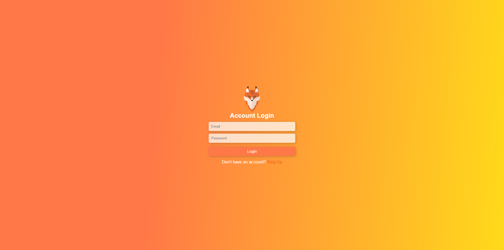

# Meu Projeto Vue.js e Express



Este projeto é uma aplicação web construída com Vue.js no frontend e Express.js no backend, usando MongoDB como banco de dados. Ele permite que os usuários façam login, visualizem seus nomes de usuário, e atualizem suas informações pessoais, como email, username e senha.

## Requisitos

- Node.js (versão 14 ou superior)
- NPM ou Yarn
- MongoDB

## Como Clonar o Repositório

Primeiro, você precisará clonar este repositório para a sua máquina local. Execute o seguinte comando no terminal:

```bash
git clone https://github.com/hectordeveloper1/paginalogin
cd nome-do-repositorio
```

## Configuração do Backend

- Instale as dependências do servidor:

```bash
cd server
npm install
```

- Crie um arquivo .env na raiz da pasta server com as seguintes variáveis de ambiente:

MONGO_URI=sua_string_de_conexao_mongodb
JWT_SECRET=sua_chave_secreta_jwt
PORT=5000

- Inicie o servidor:
```bash
npm start
```
O servidor agora estará rodando em http://localhost:5000.

## Configuração do Frontend

- Navegue até a pasta client e instale as dependências:

```bash
cd ../frontend
npm install
```
- Inicie o frontend:

```bash
npm run dev
```
